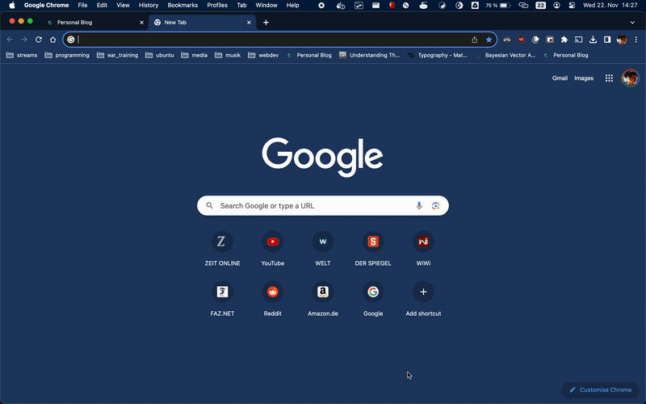

Example for securing applications behind Keycloak SSO.

# Getting Started

**Note: Depending on your system you will need to change the `oauth2-proxy` binary in the Dockerfile. It is set as `oauth2-proxy-v7.4.0.linux-arm64.tar.gz` which will work with ARM Macs.**

Use `docker compose` to build and run the containers:

```bash
docker compose build
docker compose up
```

Then navigate to `localhost/app1` or `localhost/app2` to start the authentication flow. The login user and password are both set to "test":




# What does it do?

**Dockerfile**: 

1. Starts a pre-configured Keycloak instance (config is stored in ./h2/ folder and copied to container at build-time)
2. Starts oauth2-proxy
3. Starts 2 streamlit apps

All processes are run with `supervisor` (see supervisord.conf)

**nginx/Dockerfile**:
Proxies all requests through and requests authentication through `oauth2-proxy`
